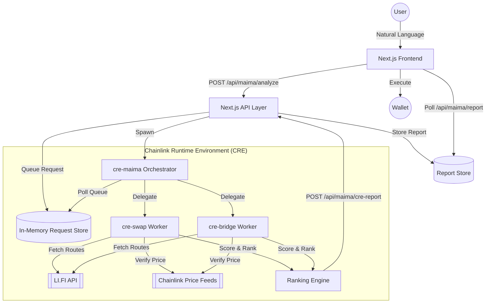

# MAIMA Architecture

This document describes the technical architecture of the **Multichain AI Intent Management Application (MAIMA)**.

## System Overview

MAIMA is a decentralized orchestration layer designed to simplify cross-chain DeFi interactions using an intent-centric model.

## Core Components

### 1. Frontend (Next.js)
- **Chat Interface**: Captures user intent via natural language.
- **Process Tracking**: A real-time UI component that reflects the state of the back-end CRE workflows.
- **Wallet Integration**: Uses RainbowKit and wagmi for secure, client-side transaction execution.

### 2. API Layer (Orchestration)
- Acts as the stateful bridge between the UI and the stateless CRE runtime.
- Manages an in-memory queue of pending requests.
- Spawns CRE workflows using the `cre` CLI.
- Proxies LI.FI status checks and stores generated analysis reports.

### 3. Chainlink Runtime Environment (CRE)
The "Brain" of the system. All complex logic (route aggregation, verification, ranking) is isolated here.
- **Orchestrator (`cre-maima`)**: Continuously monitors the API queue and delegates processing to specialized workers.
- **Specialized Workers (`cre-swap`, `cre-bridge`)**:
    - **Intent Parsing**: Converts prompts into structured parameters.
    - **Multi-Protocol Aggregation**: Direct interaction with LI.FI to find routes.
    - **Oracle Guard**: Uses Chainlink Price Feeds (e.g., ETH/USD on Base) to verify the "Fair Market Value" of a trade.
    - **Ranking Engine**: Applies a weighted scoring model (40% Gas, 30% Speed, 30% Reliability).

## Data Flow: The Journey of an Intent

1. **Input**: User types "Swap 1 ETH to USDC on Base".
2. **Analysis**: 
    - API receives the prompt and puts it in the `maimaRequests` store.
    - `cre-maima` is spawned; it sees the request and triggers `cre-swap`.
    - `cre-swap` fetches routes from LI.FI.
    - `cre-swap` queries Chainlink for the current ETH and USDC prices.
    - `cre-swap` flags any routes where the LI.FI output deviates significantly from the Chainlink price.
    - `cre-swap` calculates scores and picks the best route.
3. **Reporting**: `cre-swap` sends a detailed report back to `/api/maima?action=cre-report`.
4. **Execution**: The UI shows the "Verified" route. The user clicks "Confirm", and the frontend initiates the transaction via their wallet.

## Security Controls

- **Oracle Deviation Checks**: Prevents users from executing routes with high slippage or manipulated pricing.
- **Protocol Whitelisting**: Limits execution to industry-standard protocols (Uniswap, 1inch, etc.).
- **Isolating Logic**: Complex analysis is performed in the secure CRE environment, keeping the API layer thin and focused.
